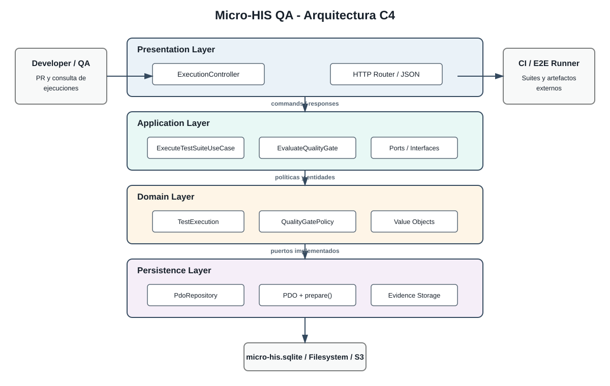

# ASII-25 — Diseño arquitectónico C4

## 1. Identificación

| Campo              | Valor                                                       |
|--------------------|-------------------------------------------------------------|
| Estudiante         | Cindy Maytté Ruano Calderón                                 |
| Módulo oficial     | ASII-25 — QA, pruebas E2E, CI y guía de despliegue final    |
| Actividad adaptada | Gestión de ejecuciones automatizadas y calidad de versiones |
| Rol / dominio      | QA / Aseguramiento de Calidad y CI/CD                       |
| Semana             | 3                                                           |
| Tema               | Diseño arquitectónico, vistas y patrones                    |
| Tecnología         | PHP 8.2+ vanilla, PDO y pruebas sin framework               |

## 2. Propósito y límites

El Micro-HIS QA ejecuta planes de pruebas, coordina suites E2E, conserva evidencia y aplica Quality Gates sobre una versión del HIS. Esta entrega define la arquitectura y sus dependencias; no sustituye la configuración real del proveedor CI ni implementa un runner E2E específico.

Restricciones técnicas:

- Separación estricta en `Presentation`, `Application`, `Domain` y `Persistence`.
- PHP 8.2+ con tipos estrictos y sin framework ni ORM.
- PDO únicamente en `Persistence`, siempre con sentencias preparadas.
- El dominio no depende de HTTP, PDO, filesystem, CI ni variables de entorno.
- Los adaptadores externos se sustituyen mediante interfaces y composición en el punto de entrada.

## 3. Vista C4: contenedores y componentes

### Nivel 2: contenedores

| Contenedor          | Responsabilidad                                             | Tecnología                    | Dependencias              |
|---------------------|-------------------------------------------------------------|-------------------------------|---------------------------|
| HTTP API            | Recibir solicitudes para planificar y consultar ejecuciones | PHP nativo                    | Application               |
| QA Application      | Orquestar casos de uso y transacciones del proceso          | PHP 8.2                       | Domain y puertos          |
| QA Domain           | Modelar ejecuciones, métricas y reglas del Quality Gate     | PHP puro                      | Ninguna infraestructura   |
| Persistence Adapter | Guardar ejecuciones y evidencias                            | PDO + SQL preparado           | Base de datos             |
| Evidence Storage    | Conservar resultados, logs y artefactos                     | Filesystem/S3 mediante puerto | Almacenamiento elegido    |
| CI/E2E Adapter      | Disparar suites y actualizar el estado de la versión        | Adaptador CLI/API             | Runner E2E y proveedor CI |

### Nivel 3: componentes principales

- `ExecutionController.php`: transforma HTTP en comandos de aplicación y respuestas.
- `PlanTestExecutionUseCase.php`: valida y registra un plan.
- `ExecuteTestSuiteUseCase.php`: coordina runner, contexto de tenant y evidencia.
- `EvaluateQualityGateUseCase.php`: solicita la evaluación de la política de dominio.
- `TestExecution.php`: entidad con ciclo de vida y métricas asociadas.
- `QualityGatePolicy.php`: regla pura de aprobación o rechazo.
- `CoveragePercentage.php`: objeto de valor que valida el rango `0..100`.
- `PdoTestExecutionRepository.php`: implementación PDO de `TestExecutionRepositoryInterface`.
- `PdoEvidenceRepository.php`: persiste metadatos con sentencias preparadas.
- `FilesystemEvidenceStorage.php`: guarda archivos fuera del dominio.



## 4. Desglose de capas

### Presentation Layer

Expone endpoints HTTP nativos y controla entrada, autenticación técnica, serialización y códigos de respuesta. `ExecutionController.php` no contiene reglas de cobertura ni SQL; invoca casos de uso y traduce excepciones a respuestas HTTP.

### Application Layer

Implementa los casos de uso del proceso: `PlanTestExecutionUseCase`, `ExecuteTestSuiteUseCase` y `EvaluateQualityGateUseCase`. Coordina puertos, controla el orden de las operaciones y define la frontera transaccional, pero delega las reglas al dominio.

### Domain Layer

Contiene entidades puras y reglas de calidad. `TestExecution` representa una ejecución; `QualityGatePolicy` decide si las métricas cumplen; `CoveragePercentage` y otros objetos de valor impiden estados inválidos. Esta capa no importa `PDO`, `$_ENV`, HTTP ni clases de proveedores.

### Persistence Layer

Implementa repositorios y almacenamiento mediante PDO. Usa `prepare()`, parámetros enlazados y transacciones. `PdoTestExecutionRepository` conoce tablas y SQL, pero satisface un contrato definido por la aplicación o el dominio. Los errores de PDO se traducen a una excepción de infraestructura estable.

## 5. Flujo de dependencias

```text
HTTP Request
    -> ExecutionController
    -> ExecuteTestSuiteUseCase
    -> TestExecutionRepositoryInterface / E2ERunnerInterface / EvidenceStorageInterface
    -> Domain: TestExecution + QualityGatePolicy
    -> adaptadores PDO, filesystem, CLI o proveedor CI
```

Las flechas de uso apuntan hacia políticas estables. La composición concreta se realiza en `bootstrap.php`, donde se enlazan interfaces con adaptadores PDO, filesystem y runner.

## 6. Patrones aplicados

| Patrón                         | Aplicación                                                                        |
|--------------------------------|-----------------------------------------------------------------------------------|
| Hexagonal / Ports and Adapters | Interfaces para repositorio, runner y almacenamiento; adaptadores en Persistence. |
| Repository                     | Oculta SQL y PDO detrás de `TestExecutionRepositoryInterface`.                    |
| Use Case                       | Cada operación del flujo tiene una clase de aplicación explícita.                 |
| Value Object                   | `CoveragePercentage` evita porcentajes fuera de rango.                            |
| Dependency Injection           | El bootstrap compone implementaciones sin `new` dentro del caso de uso.           |

## 7. Decisiones de integridad y aislamiento

- `tenant_id` forma parte del plan, de la consulta y de la clave de búsqueda de la ejecución.
- Todas las consultas de persistencia filtran por `tenant_id` y parámetros preparados.
- Los artefactos reciben un identificador de ejecución; no se sobrescriben entre tenants.
- Una excepción de almacenamiento impide marcar la ejecución como aprobada.
- La política de Quality Gate se evalúa con datos inmutables de la ejecución registrada.
