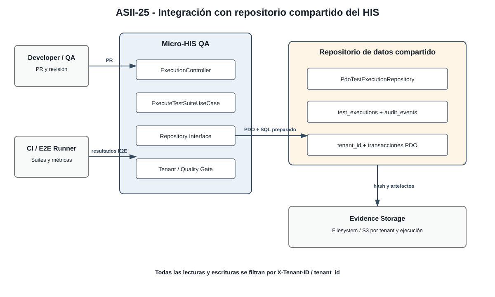

# ASII-25 — Integración con repositorio compartido

## 1. Identificación

**Estudiante:** Cindy Maytté Ruano Calderón  
**Módulo:** ASII-25 — QA, pruebas E2E, CI y guía de despliegue final  
**Actividad:** Gestión de ejecuciones automatizadas y calidad de versiones  
**Rol / dominio:** QA / Aseguramiento de Calidad y CI/CD  
**Semana:** 4

## 2. Análisis de integración

El Micro-HIS QA puede conectarse a un repositorio de datos compartido del HIS para centralizar ejecuciones, auditoría y evidencias. El acceso no elimina la separación por tenant: cada registro conserva `tenant_id`, `execution_id`, commit, suite, métricas y ubicación de artefactos.

La integración admite dos alternativas:

1. **Base central con esquema lógico por tenant:** una base SQLite/PostgreSQL compartida contiene tablas comunes y todas las consultas exigen `tenant_id`.
2. **Tablas globales de auditoría:** el HIS conserva una tabla de auditoría central para eventos de QA, mientras los artefactos pesados se almacenan en filesystem o S3 con una ruta aislada por tenant y ejecución.

La aplicación solo conoce `TestExecutionRepositoryInterface`. `PdoTestExecutionRepository` encapsula el SQL y puede apuntar a la base compartida mediante configuración de conexión, sin modificar `ExecutionController` ni las reglas de dominio.



## 3. Flujo de integración

1. GitHub Actions, GitLab CI o un runner interno dispara una ejecución con commit, suite y `X-Tenant-ID` de prueba.
2. El controlador valida el payload y el caso de uso recibe un `ExecuteSuiteCommand`.
3. El contexto de tenant se valida antes de consultar o persistir.
4. El runner devuelve métricas y resultados E2E.
5. Una transacción registra la ejecución, sus métricas y el evento de auditoría.
6. El almacenamiento de evidencias devuelve una referencia inmutable.
7. El Quality Gate decide el estado y el proveedor CI recibe el resultado.

## 4. Garantías de calidad y aislamiento

### Separación por `X-Tenant-ID`

- El `tenant_id` se obtiene del contexto autenticado, no de un campo confiado del JSON.
- Toda lectura usa `WHERE tenant_id = :tenant_id` y parámetros preparados.
- La clave lógica de evidencias es `tenant/{tenantId}/execution/{executionId}`.
- Un identificador de ejecución de otro tenant se comporta como inexistente o no autorizado según el contrato HTTP.
- Las pruebas deben intentar explícitamente un acceso cruzado y verificar que no devuelve datos.

### Concurrencia

- Cada ejecución usa un identificador único generado antes de persistir.
- La base aplica clave primaria y restricciones para evitar duplicados.
- Las actualizaciones de estado pueden usar control optimista con `version` o condición sobre el estado actual.
- El repositorio no mantiene estado mutable compartido entre solicitudes PHP.
- Los artefactos se escriben con nombre único y no se sobrescriben entre ejecuciones concurrentes.

### Transacciones PDO

La conservación de la ejecución y su evento de auditoría debe ser atómica:

```php
$pdo->beginTransaction();

try {
    $executionRepository->save($execution);
    $auditRepository->record($execution->auditEvent());
    $pdo->commit();
} catch (Throwable $exception) {
    $pdo->rollBack();
    throw new PersistenceException('Shared repository transaction failed.', previous: $exception);
}
```

El artefacto externo puede almacenarse antes o después según la política elegida, pero su referencia solo se publica como disponible cuando la transacción y la escritura del objeto terminaron correctamente. Una tarea de compensación debe limpiar archivos huérfanos.

### Integridad de evidencia

- Se guarda hash SHA-256, tamaño, tipo y fecha del artefacto.
- Los tokens JWT, secretos y datos clínicos no se incluyen en logs.
- Los resultados se asocian a commit, tenant, suite y ejecución.
- Un cambio de estado se registra en auditoría y no elimina el resultado histórico.

## 5. Contrato de configuración

```php
$pdo = new PDO(
    $_ENV['QA_SHARED_DATABASE_DSN'],
    $_ENV['QA_SHARED_DATABASE_USER'],
    $_ENV['QA_SHARED_DATABASE_PASSWORD'],
    [PDO::ATTR_ERRMODE => PDO::ERRMODE_EXCEPTION]
);

$repository = new PdoTestExecutionRepository($pdo);
```

Las credenciales se inyectan por entorno seguro del runner. Nunca se escriben en el repositorio, en los artefactos ni en mensajes de excepción.

## 6. Pruebas de integración recomendadas

| Escenario                         | Verificación                                                                           |
|-----------------------------------|----------------------------------------------------------------------------------------|
| Dos ejecuciones simultáneas       | No hay colisión de `id`; cada evidencia conserva su referencia.                        |
| Consulta con tenant ajeno         | No devuelve la ejecución y no revela sus métricas.                                     |
| Fallo entre ejecución y auditoría | Se revierte la transacción y no queda estado aprobado incompleto.                      |
| Reintento del mismo commit        | La política de idempotencia evita duplicados o registra un intento distinto explícito. |
| Artefacto alterado                | El hash almacenado no coincide y la evidencia se marca inválida.                       |

## 7. Decisión arquitectónica

El repositorio compartido es un detalle de infraestructura. La interfaz, los casos de uso y la política de Quality Gate permanecen estables. Esto permite ejecutar pruebas unitarias con `InMemoryTestExecutionRepository` y pruebas de integración con SQLite/PDO sin duplicar reglas ni ensuciar el controlador.
