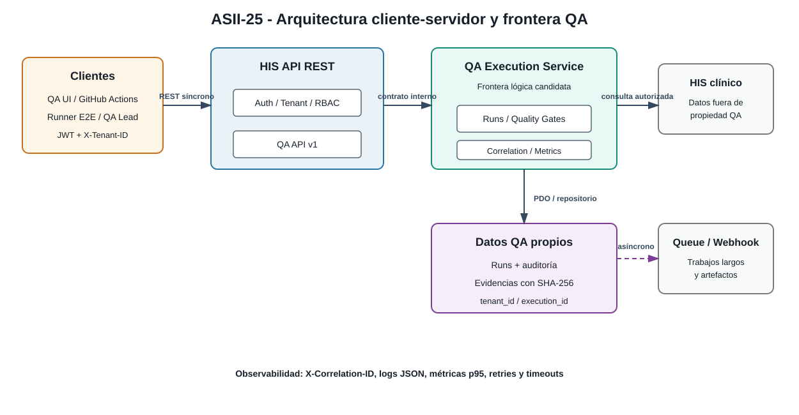

# ASII-25 — Contrato API y arquitectura cliente-servidor

## 1. Identificación

| Campo              | Valor                                                       |
|--------------------|-------------------------------------------------------------|
| Estudiante         | Cindy Maytté Ruano Calderón                                 |
| Módulo oficial     | ASII-25 — QA, pruebas E2E, CI y guía de despliegue final    |
| Actividad adaptada | Gestión de ejecuciones automatizadas y calidad de versiones |
| Rol / dominio      | QA / Aseguramiento de Calidad y CI/CD                       |
| Semana             | 5                                                           |
| Tema               | Cliente-servidor, API REST, microservicios e integración    |
| Contrato           | OpenAPI 3.0 y JSON Schema                                   |

## 2. Propósito y límites

El Micro-HIS QA evoluciona a un diseño cliente-servidor para planificar ejecuciones E2E, evaluar Quality Gates y consultar evidencias. La evidencia es un diseño/prototipo razonado; no implica desplegar una malla de servicios, un broker productivo ni infraestructura de alta disponibilidad.

## 3. Contrato API REST

### Cabeceras obligatorias

```http
Authorization: Bearer <token>
X-Tenant-ID: <tenant_uuid>
Content-Type: application/json
X-Correlation-ID: <uuid-opcional-o-generado>
```

El JWT identifica al actor y `X-Tenant-ID` delimita el contexto autorizado. El servidor no acepta un tenant del cuerpo que contradiga el contexto validado.

### Especificación OpenAPI 3.0

```yaml
openapi: 3.0.3
info:
  title: Micro-HIS QA API
  version: 1.0.0
  description: API para ejecuciones E2E, Quality Gates y evidencias.
servers:
  - url: https://his.example.test
security:
  - bearerAuth: []
paths:
  /api/v1/qa/runs:
    post:
      summary: Registrar y disparar una ejecución E2E
      operationId: createQaRun
      parameters:
        - $ref: '#/components/parameters/TenantId'
        - $ref: '#/components/parameters/CorrelationId'
      requestBody:
        required: true
        content:
          application/json:
            schema: { $ref: '#/components/schemas/CreateRunRequest' }
      responses:
        '201': { $ref: '#/components/responses/Created' }
        '400': { $ref: '#/components/responses/BadRequest' }
        '401': { $ref: '#/components/responses/Unauthorized' }
        '403': { $ref: '#/components/responses/Forbidden' }
        '422': { $ref: '#/components/responses/ValidationError' }
  /api/v1/qa/gates/evaluate:
    post:
      summary: Evaluar un Quality Gate
      operationId: evaluateQualityGate
      parameters:
        - $ref: '#/components/parameters/TenantId'
        - $ref: '#/components/parameters/CorrelationId'
      requestBody:
        required: true
        content:
          application/json:
            schema: { $ref: '#/components/schemas/GateEvaluationRequest' }
      responses:
        '200': { $ref: '#/components/responses/Ok' }
        '400': { $ref: '#/components/responses/BadRequest' }
        '401': { $ref: '#/components/responses/Unauthorized' }
        '403': { $ref: '#/components/responses/Forbidden' }
        '422': { $ref: '#/components/responses/ValidationError' }
  /api/v1/qa/runs/{id}/evidence:
    get:
      summary: Consultar evidencias y logs
      operationId: getRunEvidence
      parameters:
        - $ref: '#/components/parameters/TenantId'
        - $ref: '#/components/parameters/CorrelationId'
        - name: id
          in: path
          required: true
          schema: { type: string, format: uuid }
      responses:
        '200': { $ref: '#/components/responses/OkEvidence' }
        '401': { $ref: '#/components/responses/Unauthorized' }
        '403': { $ref: '#/components/responses/Forbidden' }
        '404': { description: Ejecución inexistente en el tenant actual }
        '422': { $ref: '#/components/responses/ValidationError' }
components:
  securitySchemes:
    bearerAuth: { type: http, scheme: bearer, bearerFormat: JWT }
  parameters:
    TenantId:
      name: X-Tenant-ID
      in: header
      required: true
      schema: { type: string, format: uuid }
    CorrelationId:
      name: X-Correlation-ID
      in: header
      required: false
      schema: { type: string, format: uuid }
  schemas:
    CreateRunRequest:
      type: object
      required: [commit, suites]
      properties:
        commit: { type: string, minLength: 7, maxLength: 64 }
        branch: { type: string, maxLength: 255 }
        suites: { type: array, minItems: 1, items: { type: string } }
        callbackUrl: { type: string, format: uri }
    GateEvaluationRequest:
      type: object
      required: [runId, coverage, criticalFailures]
      properties:
        runId: { type: string, format: uuid }
        coverage: { type: number, minimum: 0, maximum: 100 }
        criticalFailures: { type: integer, minimum: 0 }
        durationSeconds: { type: integer, minimum: 0 }
    RunResponse:
      type: object
      required: [id, status, tenantId, commit]
      properties:
        id: { type: string, format: uuid }
        tenantId: { type: string, format: uuid }
        commit: { type: string }
        status: { type: string, enum: [queued, running, approved, failed] }
        correlationId: { type: string, format: uuid }
    GateResponse:
      type: object
      required: [runId, decision, reasons]
      properties:
        runId: { type: string, format: uuid }
        decision: { type: string, enum: [passed, failed] }
        reasons: { type: array, items: { type: string } }
    EvidenceResponse:
      type: object
      required: [runId, artifacts]
      properties:
        runId: { type: string, format: uuid }
        artifacts:
          type: array
          items:
            type: object
            required: [name, url, sha256]
            properties:
              name: { type: string }
              url: { type: string, format: uri }
              sha256: { type: string, pattern: '^[a-f0-9]{64}$' }
              contentType: { type: string }
    Error:
      type: object
      required: [code, message, correlationId]
      properties:
        code: { type: string }
        message: { type: string }
        correlationId: { type: string, format: uuid }
  responses:
    Created: { description: Ejecución registrada, content: { application/json: { schema: { $ref: '#/components/schemas/RunResponse' } } } }
    Ok: { description: Quality Gate evaluado, content: { application/json: { schema: { $ref: '#/components/schemas/GateResponse' } } } }
    OkEvidence: { description: Evidencias consultadas, content: { application/json: { schema: { $ref: '#/components/schemas/EvidenceResponse' } } } }
    BadRequest: { description: JSON mal formado, content: { application/json: { schema: { $ref: '#/components/schemas/Error' } } } }
    Unauthorized: { description: JWT ausente, inválido o expirado, content: { application/json: { schema: { $ref: '#/components/schemas/Error' } } } }
    Forbidden: { description: Rol o tenant no autorizado, content: { application/json: { schema: { $ref: '#/components/schemas/Error' } } } }
    ValidationError: { description: Esquema o regla de calidad no válida, content: { application/json: { schema: { $ref: '#/components/schemas/Error' } } } }
```

### Semántica HTTP

| Código                     | Uso                                               |
|----------------------------|---------------------------------------------------|
| `200 OK`                   | Quality Gate evaluado o evidencias consultadas.   |
| `201 Created`              | Ejecución registrada para procesamiento.          |
| `400 Bad Request`          | JSON mal formado.                                 |
| `401 Unauthorized`         | JWT ausente, inválido o expirado.                 |
| `403 Forbidden`            | Rol o tenant no autorizado.                       |
| `422 Unprocessable Entity` | JSON válido que incumple el contrato o una regla. |

## 4. Cliente-servidor y frontera de microservicio

El cliente puede ser la interfaz de QA, GitHub Actions o un runner interno. El servidor valida autenticación y tenant, delega en casos de uso y responde JSON; el dominio permanece independiente del transporte.

- **REST síncrono:** registrar runs, evaluar Gates y consultar metadatos.
- **Asíncrono:** suites largas, vídeos y artefactos pesados mediante colas o webhooks.
- `POST /qa/runs` puede responder `201` con estado `queued`; el resultado final se notifica o consulta posteriormente.

La frontera candidata es un **QA Execution Service**, propietario de ejecuciones, métricas y referencias de evidencia. No escribe tablas clínicas del HIS.

| Criterio           | Decisión                                                                  |
|--------------------|---------------------------------------------------------------------------|
| Propiedad de datos | QA posee runs, métricas y auditoría QA.                                   |
| Comunicación       | REST para comandos pequeños; cola/webhook para trabajos largos.           |
| Seguridad          | JWT, `X-Tenant-ID`, RBAC/scopes y correlation ID.                         |
| Resiliencia        | Timeouts, retries limitados, backoff, idempotency key y circuit breaker.  |
| Observabilidad     | Logs JSON, latencia p95, fallos y trazas por correlation ID.              |
| Consistencia       | Estado eventual para trabajos asíncronos; hashes de evidencia inmutables. |



## 5. Evolución sin sobreingeniería

No se divide prematuramente el sistema en múltiples servicios, bases o brokers porque todavía no hay métricas de carga. La evolución es: (1) contrato REST y módulo QA; (2) medición de volumen, latencia, errores y tamaño de evidencias; (3) extracción del servicio solo si el aislamiento o escalado independiente lo justifica.

Las operaciones deben usar timeouts, retries solo para fallos transitorios e idempotentes, `Idempotency-Key`, logs sin secretos, métricas de runs por estado y propagación de `X-Correlation-ID`.
